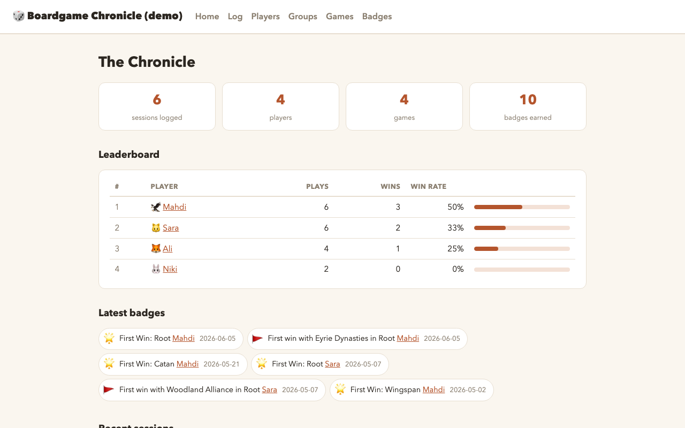
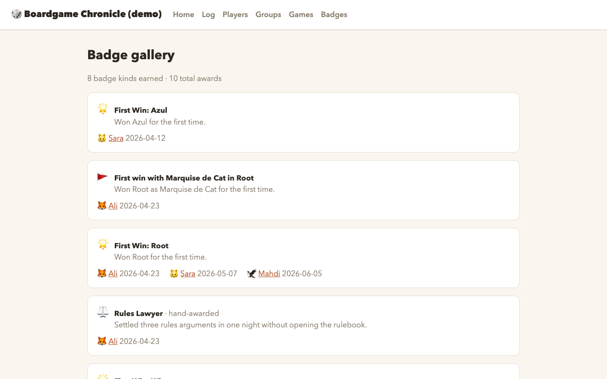

# 🎲 Boardgame Chronicle

[](https://github.com/mhb8898/boardgame-chronicle/actions/workflows/deploy.yml)
[](https://github.com/mhb8898/boardgame-chronicle/releases)
[](LICENSE)

**Track your board game nights with plain YAML files — get a beautiful stats
& badges website for free.** No accounts, no apps, no database. Your git repo
*is* the database: each play session is a small YAML file. On every push,
GitHub Actions validates the data, recomputes all stats and badges, and
deploys the site to GitHub Pages.

**[Live demo →](https://mhb8898.github.io/boardgame-chronicle/)** (this repo's sample data)

| Leaderboard & latest badges | Badge gallery |
|---|---|
|  |  |

## Why

- 📝 **Logging a play = committing a 10-line YAML file** — from your phone, via the GitHub web UI if you like.
- 🏆 **Badges are computed, not stored** — fix old data and history corrects itself. First wins, streaks, faction completionism, milestones.
- 🛡️ **Builds fail loudly on bad data** — typo'd player id or unknown faction never reaches the site.
- 🆓 **Free forever** — public repo + GitHub Pages + GitHub Actions.
- 🔌 **Engine and data are separate repos** — upgrade the engine without touching your log, or pin a version and never think about it.

## Quick start (5 minutes)

The easiest way: **[use the template repo →](https://github.com/mhb8898/boardgame-chronicle-template)**

1. Click **Use this template** → create your repo (public, for free GitHub Pages).
2. In your new repo: **Settings → Pages → Source → GitHub Actions**.
3. Edit `chronicle.config.yaml` with your title and URLs.
4. Replace the example players/games/sessions in `data/` with yours.
5. Push — your site is live.

### Manual setup

Create a repo with this layout (copy formats from this repo's `data/` directory):

```
your-gamelog/
├── data/
│   ├── players.yaml
│   ├── groups.yaml
│   ├── games.yaml
│   ├── sessions/           # one YAML file per play
│   └── badges/manual.yaml  # optional
├── chronicle.config.yaml
└── .github/workflows/deploy.yml
```

`chronicle.config.yaml`:

```yaml
title: My Game Log
site: https://YOUR-USERNAME.github.io
base: /your-gamelog            # your repo name
repoUrl: https://github.com/YOUR-USERNAME/your-gamelog   # optional footer link
```

`.github/workflows/deploy.yml` — pick one of two styles:

**One-line job** (reusable workflow — simplest):

```yaml
name: Deploy
on:
  push: { branches: [main] }
  workflow_dispatch:
permissions: { contents: read, pages: write, id-token: write }
jobs:
  chronicle:
    uses: mhb8898/boardgame-chronicle/.github/workflows/build-deploy.yml@main
    # Pin a version for stability:
    # with: { engine-ref: v1 }
```

**Composable step** (GitHub Action — if you want your own workflow):

```yaml
name: Deploy
on:
  push: { branches: [main] }
  workflow_dispatch:
permissions: { contents: read, pages: write, id-token: write }
jobs:
  build:
    runs-on: ubuntu-latest
    steps:
      - uses: actions/checkout@v4
      - uses: mhb8898/boardgame-chronicle@v1   # the engine version
  deploy:
    needs: build
    runs-on: ubuntu-latest
    environment:
      name: github-pages
      url: ${{ steps.deployment.outputs.page_url }}
    steps:
      - id: deployment
        uses: actions/deploy-pages@v4
```

### Upgrading

- Tracking `@main` (the default): every push of yours builds with the latest
  engine — nothing to do.
- Pinned to a tag: bump the `@vX` in `uses:` (and `engine-ref` for the
  reusable workflow) when a new
  [release](https://github.com/mhb8898/boardgame-chronicle/releases) is out.
  The floating `v1` tag always points at the latest compatible release.

Your data never changes shape silently: any breaking data-format change comes
with a major version tag and release notes.

## Logging a session

Create one file per play in `data/sessions/`, named `YYYY-MM-DD-<game>.yaml`:

```yaml
date: 2026-06-05
game: root                # id from data/games.yaml
group: thursday-crew      # id from data/groups.yaml
location: Mahdi's place   # optional
notes: First Eyrie win!   # optional
players:
  - { player: mahdi, faction: eyrie, winner: true }
  - { player: sara, faction: marquise, score: 24 }
```

- `winner` defaults to `false`; multiple winners (co-op/teams) or zero winners
  (the game won) are both fine.
- `faction` and `score` are optional, but factions unlock faction badges.

Commit, push — done. The build **fails loudly** on any typo'd id, unknown
faction, or malformed file, so bad data never reaches the site.

### Logging from the site (no git needed)

Optionally, your site can grow a **“+ Log a play” form** — phone-friendly,
with dropdowns for your actual games, groups, players, and factions. Friends
just need a GitHub account; no git knowledge.

How it works: the form opens a prefilled GitHub issue on your data repo → a
workflow validates the YAML with the engine's own schema and posts a preview
comment → a maintainer adds the **approved** label → the session is committed
and the site redeploys. Invalid submissions get the error as a comment instead.

To enable it, in your **data repo**:

1. Add to `chronicle.config.yaml` (this switches the form on):

   ```yaml
   dataRepoUrl: https://github.com/YOUR-USERNAME/your-gamelog
   ```

2. Add `.github/workflows/log.yml`:

   ```yaml
   name: Log Session
   on:
     issues: { types: [opened, edited, labeled] }
   permissions: { contents: write, issues: write, pages: write, id-token: write }
   jobs:
     log:
       uses: mhb8898/boardgame-chronicle/.github/workflows/log-issue.yml@main
     deploy: # GITHUB_TOKEN pushes don't trigger the push-based deploy
       needs: log
       if: needs.log.outputs.committed == 'true'
       uses: mhb8898/boardgame-chronicle/.github/workflows/build-deploy.yml@main
       with: # build the branch head, not the pre-commit event SHA
         data-ref: ${{ github.event.repository.default_branch }}
   ```

3. Create the `log` and `approved` labels in your repo
   (`gh label create log` / `gh label create approved`).

Only users with **write** permission on the repo can approve. The validation
logic is also available locally: `npm run validate-session -- --yaml-file
<file> [--data-dir data]`.

## Adding players, groups, games

- `data/players.yaml` — roster: `id`, `name`, optional `avatar` emoji.
- `data/groups.yaml` — groups: `id`, `name`, `members` (player ids), optional `description`.
- `data/games.yaml` — registry: `id`, `name`, optional `factions` (`{id, name}` list),
  `bggId`, `minPlayers`, `maxPlayers`.

## Badges

Badges are **recomputed from the full log on every build** — fix old data and
history corrects itself.

Automatic rules (see `src/badges/config.ts` for thresholds):

| Badge | Earned by |
|---|---|
| 🌟 First Win: *game* | first victory in each game |
| 🚩 First win with *faction* in *game* | first victory with each faction |
| 🥉🥈🥇 *N* Games Played | 10 / 25 / 50 sessions |
| 🥉🥈🥇 *N* Wins | 5 / 15 / 30 victories |
| 🔥 On Fire | 3 wins in a row |
| 💎 Completionist: *game* | won with every faction of a game |
| 🥉🥈🥇 Explorer | played 5 / 10 / 20 distinct games |

**Hand-awarded badges** for special moments go in `data/badges/manual.yaml`:

```yaml
- id: comeback-king
  title: Comeback King
  description: Won after being last at mid-game.
  icon: "👑"
  player: mahdi
  session: 2026-06-05-root   # or a `date:` if not tied to a session
```

**New rule?** Write a small factory in `src/badges/rules/` returning a
`BadgeRule` (look at `streaks.ts` for the pattern), add it to
`src/badges/config.ts`, and add a test in `src/badges/engine.test.ts`.

## Development

```sh
npm install
npm test          # schema, stats, and badge-engine tests
npm run dev       # local dev server
npm run build     # full static build (validates all data)
```

## Deploying

Pushes to `main` run `.github/workflows/deploy.yml`: tests → Astro build →
GitHub Pages. One-time setup: repo **Settings → Pages → Source → GitHub Actions**.

## License

[MIT](LICENSE)
